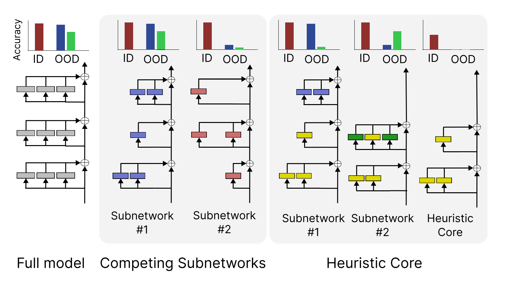

# The Heuristic Core

This repository contains the code and data for the paper "[The Heuristic Core: Understanding Subnetwork Generalization in Pretrained Language Models](https://arxiv.org/abs/2403.03942)".

In this paper, we use structured pruning to isolate multiple subnetworks in a finetuned BERT that all show in-domain performance similar to the full model, but very disparate generalization out-of-domain. We then study why this phenomenon occurs, and use our analysis to gain insight into how a model generalizes: it first learns a "heuristic core" of heads that do not generalize on their own. Later, other heads learn behavior that composes these heads' outputs to implement more complex primitives.

<p align="center">
  
</p>

## Quick Links

- [Environment](#environment)
- [Pruned models](#pruned-models)
- [Repository structure](#repository-structure)
- [Reproducing our pruning runs](#reproducing-our-pruning-runs)
- [Reproducing our plots](#reproducing-our-plots)
- [Bugs or questions?](#bugs-or-questions)
- [Citation](#citation)

## Environment
Please run
```
pip install -r requirements.txt
```
to install the necessary packages. You may have to install [PyTorch](https://pytorch.org/) separately first.

## Pruned models

Due to the effective size experiments, we had to prune the two BERTs to more than 100 subnetworks for the various experiments. These amount to a large amount of storage, hence the model checkpoints are currently not uploaded here (we are investigating what the best way to release these models may be). In the meantime, you can run the code we provide to reproduce our results. We also provide the JSON files produced by running the models, as discussed [below](#repository-structure).

## Repository structure

This repository is structured as follows:
- `src/` contains the code we use for finetuning the BERTs (under `src/ft/`) and prune them (`src/pruning/`). The former is simply the popular huggingface `run_glue.py` file. You may be more interested in the pruning code: the file `l0.py` defines sampling primitives used to model the masks. `modeling_pert.py` modifies the huggingface BERT implementation to a prunable BERT model, while `prune-glue.py` implements the pruning process, and is closely modeled after `run_glue.py`. We have tried to use simple variable names and comments to make the code easy to read.
-  The `scripts/` directory contains all the scripts that either help in launching the pruning runs, generating the data used for our plots, or plotting the generated data.
- The `data/` directory contains the data and plots generated above for the models we used in the paper.

### Reproducing our pruning runs

This subsection outlines how you can prune a finetuned BERT model with our code, with MNLI as the chosen example.

First, you should calculate the average activations of the model of the training dataset, for use in pruning (we replace missing heads and layers by adding their average activation as per recommendations in Mechanistic Interpretability). This looks like
```
python scripts/pruning/save-avg-activations.py \
    --dataset mnli \
    --key1 premise \
    --key2 hypothesis \
    --initialize-from models/ft/MNLI-61360 \
    --out-path data/activations/mnli.pkl
```
If you don't have a `key2` (like for QQP), pass in the string `none` instead.

Once this is done, you can call upon `src/pruning/prune-glue.py` almost like you would `run_glue.py`. Some arguments this script accepts are new, such as:
- `--initialize_from` should point to the finetuned model you are pruning.
- `--start_sparsity` is the target sparsity at the *beginning*, and likely 0 (we increase the target gradually).
- `--target_sparsity` is the target sparsity that we finally reach through slow linear ascent.
- `--num_sparsity_warmup_steps` specifies the number of steps over which the above target must be reached. You should typically set this close to the total number of pruning steps.
- `--learning_rate` is the learning rate only for the `log_alpha` parameters which determine the mask values.
- `--reg_learning_rate` is the learning rate for the regularization lambdas (see our paper for a longer discussion).

For an example run, see `scripts/pruning/prune-all-mnli.sh`. This script also has the exact hyperparameters used by our runs for the main figure, and has the grid search values used for the effective size experiment in its comments.

## Reproducing our plots

For reproducing the data for the plots from our paper, please check out the python scripts under `scripts/eval`. We provide our scripts for all cases that involve setting any parameters like thresholds. Additionally, we provide the JSON files our models produced using these scripts in `data/eval/`. The scripts under `scripts/visualization` do the actual plotting. We release the corresponding plots in `data/plots`.

## Bugs or questions?

If you have any questions about our methods, results or code, please email Adithya (`adithyab <at> princeton <dot> edu`). If you want to report a bug, you can open an issue. More details will help us fix the bug quicker!

## Citation

Please cite our paper if you found it useful in your work:
```
@inproceedings{bhaskar2024heuristic,
   title={The Heuristic Core: Understanding Subnetwork Generalization in Pretrained Language Models},
   author={Bhaskar, Adithya and Friedman, Dan and Chen, Danqi},
   booktitle={Association for Computational Linguistics (ACL)},
   year={2024}
}
```
